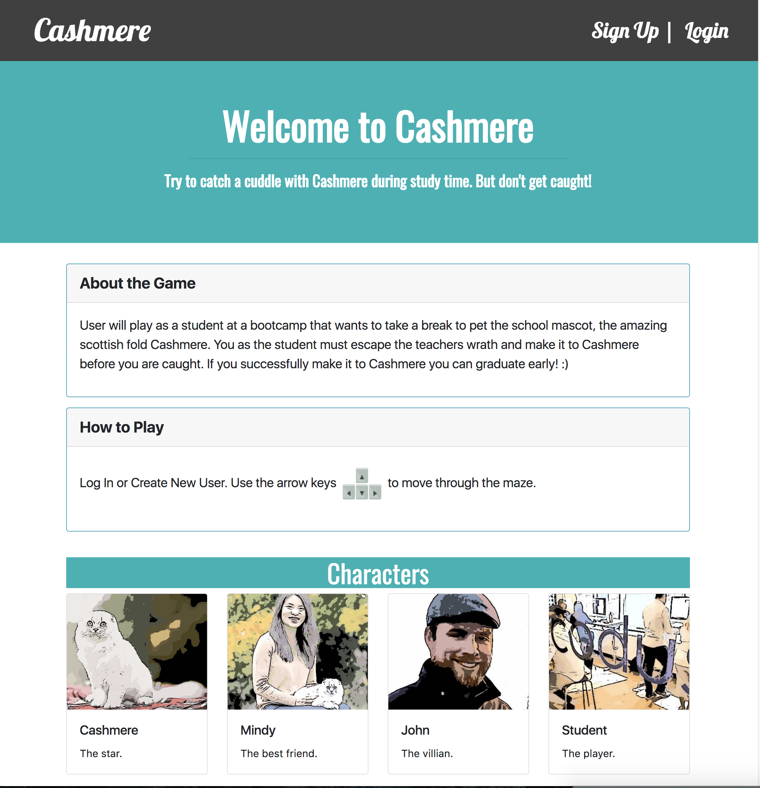
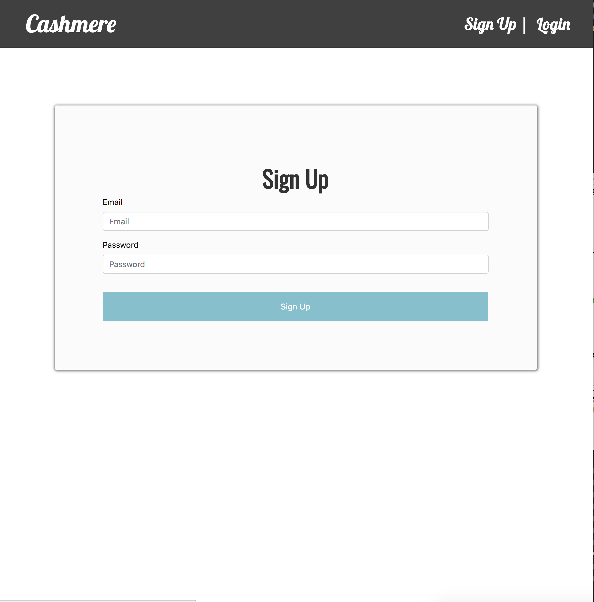
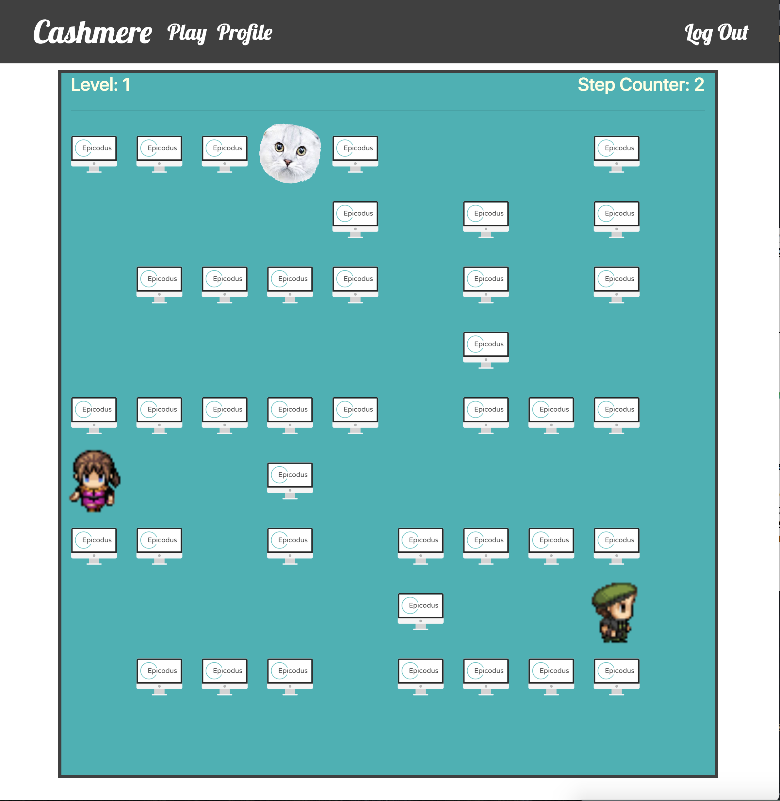

# Cashmere
#### Team Week project for Epicodus

### By Jamie Pittak, Panatda Inthala, Eric Swotinsky, Nanette Girzi, Tyler Kostelak, Dillon Titcomb

## Description
User will play as a student at a bootcamp that wants to take a break to pet the school mascot, the amazing scottish fold Cashmere. You as the student must escape the teachers wrath and make it to Cashmere before you are caught. If you successfully make it to Cashmere you can graduate early! :)

## Setup
[Play the game here.](https://cashmere-4b510.firebaseapp.com/)

or

1. Make sure you have Angular, Node.js and npm installed
2. Clone this repository
3. Open project in editor of your choice
4. Create file src/app/api-keys.ts
5. go to firebase to retrieve the below information
          apiKey: "xxxx",
          authDomain: "xxxx.firebaseapp.com",
          databaseURL: "https://xxxx.firebaseio.com",
          storageBucket: "xxxx.appspot.com",
          messagingSenderId: "xxxx"
6. paste this information in your api-key.ts
          export var masterFirebaseConfig = {

          ...

          };
7. import database file located in project folder to firebase
8. type npm install in your terminal
9. After npm install is finished, type ng serve -o
10. this should automatically open http://localhost:4200/

## Known Bugs
-None at current time-

## Specifications
1. user will make login info
2. login info will be stored in database
3. game board loads on launch
4. player moves based on arrow key press
5. if obstacle is in place player will move around obstacle
6. enemy will follow player
7. if enemy collides with player game is over
8. if player reaches goal game is won
9. game has step counts as a grade/score
10. if player wins score page will pop up and score will be stored in database

_ Home page

_ Sign-Up page

_ Game Play page

## Technologies Used
* Typescript
* Angular
* Firebase
* Breadth First Search Algorithm  
* HTML
* CSS
* Bootstrap

## Development server

Run `ng serve` for a dev server. Navigate to `http://localhost:4200/`. The app will automatically reload if you change any of the source files.

## Code scaffolding

Run `ng generate component component-name` to generate a new component. You can also use `ng generate directive|pipe|service|class|guard|interface|enum|module`.

## Build

Run `ng build` to build the project. The build artifacts will be stored in the `dist/` directory. Use the `-prod` flag for a production build.

## Running unit tests

Run `ng test` to execute the unit tests via [Karma](https://karma-runner.github.io).

## Running end-to-end tests

Run `ng e2e` to execute the end-to-end tests via [Protractor](http://www.protractortest.org/).

## Further help

To get more help on the Angular CLI use `ng help` or go check out the [Angular CLI README](https://github.com/angular/angular-cli/blob/master/README.md).

## Legal
Copyright (c) 2018 Jamie Pittak, Panatda Inthala, Eric Swotinsky, Nanette Girzi, Tyler Kostelak, Dillon Titcomb
